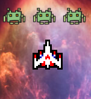
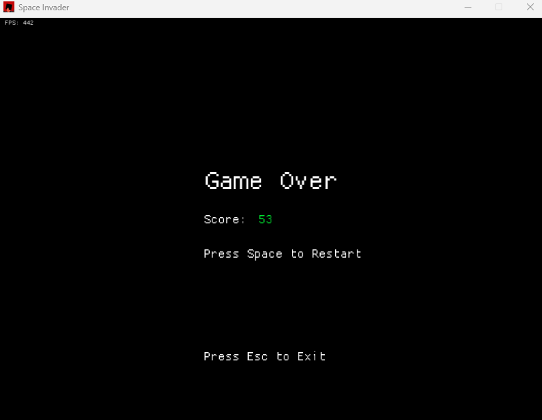
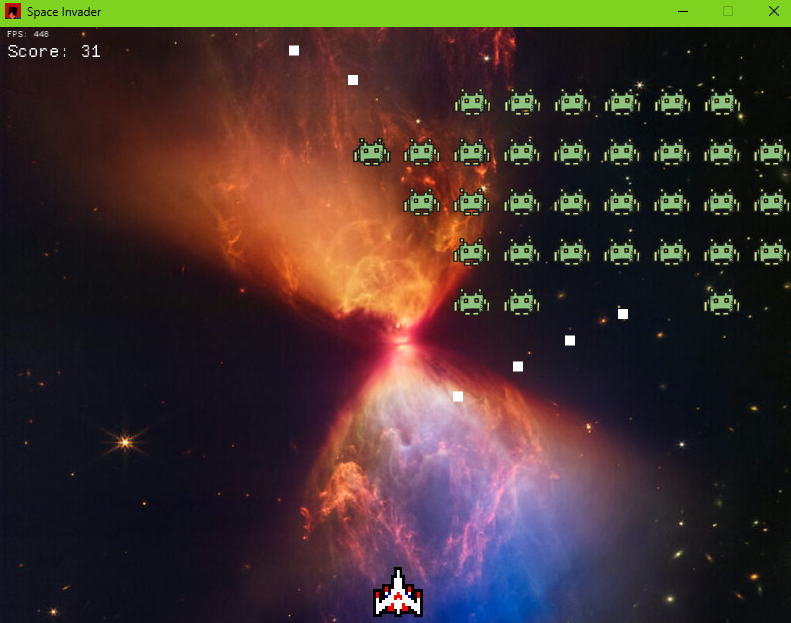

<p align="center">
  <a href="" rel="noopener">
 
 </a>
</p>

<h3 align="center">Space Invader Rust</h3>

<div align="center">

[]()
[]()
[]()
[](/LICENSE)

</div>

---

<p align="center"> Simple space invader game written in Rust.
    <br>
</p>

## 🧐 About <a name = "about"></a>

This is a simple space invader game written in Rust. I am using the OOP approach to write this game. I use macroquad for the game engine.

## 🏁 Getting Started <a name = "getting_started"></a>

Here step by step how to run this game.

### Prerequisites

You must have `cargo` installed on your machine. You can install it from [here](https://doc.rust-lang.org/cargo/getting-started/installation.html).

### Installing

A step by step series of examples that tell you how to get a development env running.

1. Clone this repo

```shell
git clone git@github.com:fatihaziz/space-invader-rust-oop.git
```

2. Move to directory

```shell
cd space-invader-rust-oop
```

3. Run the game

```shell
cargo run
```

# 🎯 Next Goals

- [ ] Add more waves
- [ ] Add more movement dynamic for the enemies
- [ ] Make the last boss like Tohou game, it can move and shoot at the same time

## 📷 Screenshots<a name = "screenshots"></a>

### Game Over



### Game Play



</br>

## ⛏️ Built Using <a name = "built_using"></a>

- [Rust](https://www.rust-lang.org/) - Language
- [Macroquad](https://github.com/not-fl3/macroquad) - Game Engine

## ✍️ Authors <a name = "authors"></a>

- [@fatihaziz](https://github.com/fatihaziz) - Dev

See also the list of [contributors](https://github.com/kylelobo/The-Documentation-Compendium/contributors) who participated in this project.

## 🎉 Acknowledgements <a name = "acknowledgement"></a>

- Hat tip to anyone whose code was used
- Inspiration
- References
  - [@titan3755](https://github.com/titan3755/space-invaders)
